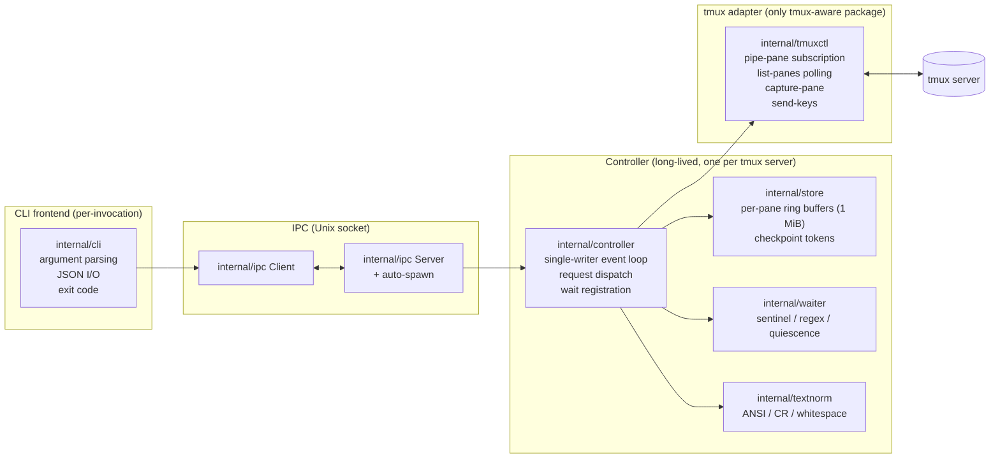
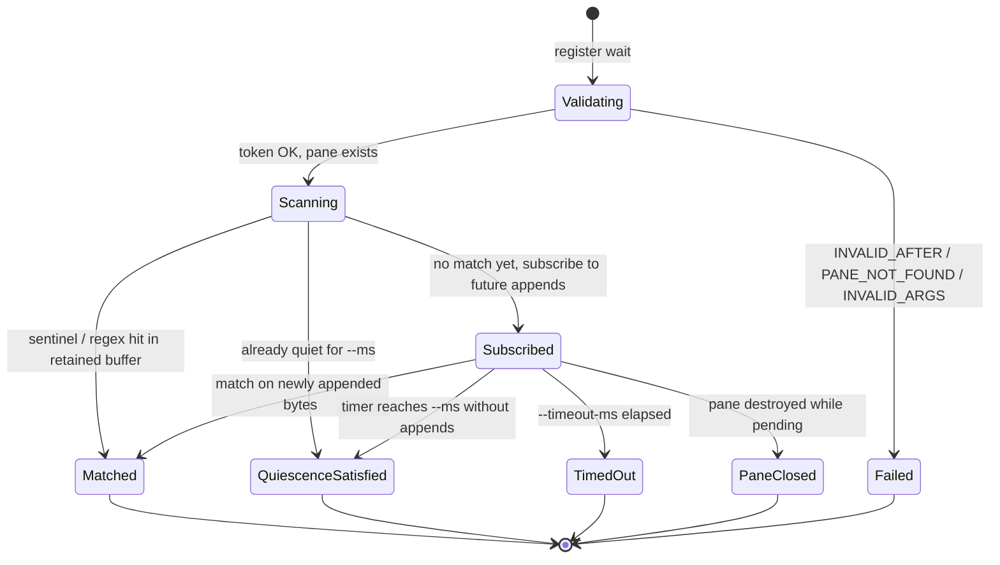

# Architecture

A visual companion to the normative [`docs/specs/tpctl-v1.md`](specs/tpctl-v1.md)
and the slice-by-slice [`docs/plan/tpctl-v1-implementation.md`](plan/tpctl-v1-implementation.md).

Diagrams render on GitHub.

## Component overview

`tpctl` is a hexagonal system split into a short-lived CLI frontend
and a long-lived controller. The controller owns all mutable state;
the CLI is stateless. The tmux-facing adapter is the only component
that speaks tmux protocol.



### What lives where

| Package | Role | Depends on tmux? |
|---|---|---|
| `internal/domain` | response types, error codes, canonical JSON shapes | no |
| `internal/textnorm` | pure functions for spec §8.3 normalization | no |
| `internal/waiter` | pure matchers: sentinel, regex (RE2), quiescence | no |
| `internal/store` | ring buffers, opaque tokens, eviction policy | no |
| `internal/controller` | event loop, handlers, wait coordination | no (via `tmuxctl.Port`) |
| `internal/ipc` | Unix-socket transport + auto-spawn, setsid detachment | no |
| `internal/cli` | argparse, stdout/stderr, dispatch | no |
| `internal/tmuxctl` | the tmux facade; the only package that `exec`s tmux | yes |
| `cmd/tpctl` | thin entrypoint | no |

The hexagonal contract is the `tmuxctl.Port` interface: the controller
sees only that interface, so component tests swap in a fake and never
touch tmux.

## Request lifecycle

A typical request — say, `tpctl read --pane %42 --after TOK` — flows
through every layer. The CLI is stateless; the controller owns the
store and the subscription channel.

```mermaid
sequenceDiagram
    autonumber
    actor Agent
    participant CLI as tpctl (CLI)
    participant DM as tpctl daemon
    participant Loop as controller loop
    participant Store as store
    participant Tmx as tmuxctl (adapter)
    participant Tmux as tmux server

    Agent->>CLI: tpctl read --pane %42 --after TOK
    CLI->>CLI: parse flags, validate --pane
    CLI->>DM: dial Unix socket (auto-spawn if needed)
    note right of CLI: auto-spawn runs setsid +<br/>stdio-detached daemon
    CLI->>DM: {op: "read", pane: "%42", after: "TOK"}
    DM->>Loop: enqueue request
    Loop->>Store: Read(%42, TOK)
    alt pane missing
        Store-->>Loop: ErrPaneUnknown
        Loop-->>DM: {code: "PANE_NOT_FOUND", ...}
    else token evicted or wrong
        Store-->>Loop: ErrTokenEvicted / WrongPane
        Loop-->>DM: {code: "INVALID_AFTER", ...}
    else success
        Store-->>Loop: bytes, next-token
        Loop-->>DM: {pane_id, next, text}
    end
    DM-->>CLI: response envelope
    CLI-->>Agent: JSON on stdout, exit 0/1

    note over Tmx,Tmux: In parallel: the adapter is<br/>streaming pane output into<br/>the store via pipe-pane
```

Key properties:

- Every mutation of the store happens on the single controller
  goroutine — no locks needed between handlers.
- The adapter runs its own goroutine that appends to the store as
  tmux emits bytes; `read` and `wait` observe those bytes
  passively.
- Auto-spawn is TOCTOU-safe: the CLI tries to connect, acquires a
  `flock`, tries to connect again (in case another invocation won
  the race), and only then spawns.

## Race-free `snapshot → text → wait`

This is the correctness heart of the whole design. An agent that
wants to run a command and know when it finished — including a
pass/fail indication — uses this pattern. The diagram shows why
output produced between `text` returning and `wait` registering
cannot be missed.

```mermaid
sequenceDiagram
    autonumber
    actor Agent
    participant CLI as tpctl (CLI)
    participant Loop as controller loop
    participant Store as store
    participant Tmx as tmuxctl (adapter)
    participant Shell as shell in pane

    Agent->>CLI: snapshot --pane %42
    CLI->>Loop: snapshot
    Loop->>Store: NewToken(%42) → T0 at offset=100
    Loop-->>CLI: {next: "T0", text: "..."}
    CLI-->>Agent: T0

    Agent->>CLI: text --pane %42 "make; echo __DONE__:r:$?" --enter
    CLI->>Loop: sendText
    Loop->>Tmx: SendText + Enter
    Tmx->>Shell: keys delivered
    Tmx-->>Loop: ack (tmux returned)
    Loop-->>CLI: ok
    CLI-->>Agent: exit 0

    par Shell produces output (possibly fast)
        Shell->>Tmx: "make...\n__DONE__:r:0\n"
        Tmx->>Store: append at offset 100..160
    and Agent invokes wait
        Agent->>CLI: wait --after T0 --for sentinel --token r
        CLI->>Loop: registerWait(pane=%42, after=T0, sentinel=r)
    end

    note over Loop,Store: wait scans [T0=100, current) FIRST.<br/>If the sentinel is already in the buffer,<br/>it matches immediately — no subscription<br/>needed. Fast output cannot slip through.
    Loop->>Store: Read(%42, T0) → bytes so far
    Loop->>Loop: match sentinel in buffered bytes?
    alt already matched
        Loop-->>CLI: {result: "sentinel", matched, exit_code: 0, next: T1}
    else not yet
        Loop->>Loop: subscribe to future appends until timeout
    end
    CLI-->>Agent: JSON on stdout
```

The two guarantees that combine to make this race-free:

1. **Send-ack.** `text` and `key` return only after tmux has
   acknowledged the send (spec §9.4, §9.5). The controller knows the
   input has reached tmux before the CLI exits.
2. **Checkpoint scan.** `wait --after TOKEN` first scans the retained
   buffer from the token position forward (spec §9.6). Any output
   that was appended while the CLI was in flight — between `text`
   returning and `wait` registering — is already sitting in the
   buffer when `wait` starts scanning, and is matched immediately.

Result: the `snapshot → text → wait` pattern is correct regardless
of scheduling or output latency.

## Wait lifecycle

Wait registrations are passive, read-only observers of the stream.
Many can be outstanding on the same pane at once with different
modes, patterns, and timeouts.



Multiple waits on the same pane do not interact: each is scored
independently against the same stream, and a single output append
may satisfy zero, one, or many of them. The single-writer controller
loop serializes `text`/`key` sends, but `wait`s never block sends
and sends never cancel `wait`s.

## See also

- [`docs/specs/tpctl-v1.md`](specs/tpctl-v1.md) — the normative
  contract. Architecture patterns are in §10, internal structure
  in §12, state machines in §13, tmux integration in §14.
- [`docs/plan/tpctl-v1-implementation.md`](plan/tpctl-v1-implementation.md)
  — slice-by-slice build plan, retrospective, and known deviations.
- [`README.md`](../README.md) — quick-start and command examples
  for agents and humans.
